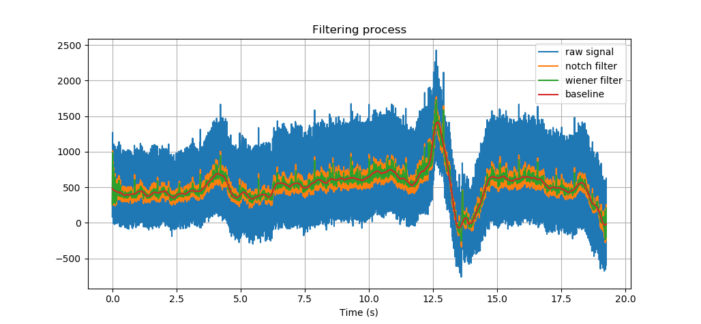

ecg\_feature\_selection package
===============================

Submodules
----------

ecg\_feature\_selection.ecg\_feature\_selection module
------------------------------------------------------

.. automodule:: ecg_feature_selection.ecg_feature_selection
    :members:
    :undoc-members:
    :show-inheritance:

*Example of filtering process:*

*Example of use:*

.. code-block:: python
	
	bpm = get_bpm(signal)
	rhythm_std, rhythm_diff = rythmRegularity(signal)
	pr = interval(signal, 'pr')
	rt = interval(signal, 'rt')
	wave_domain, wave = segmenter(signal)

Module contents
---------------

.. automodule:: ecg_feature_selection
    :members:
    :undoc-members:
    :show-inheritance:
